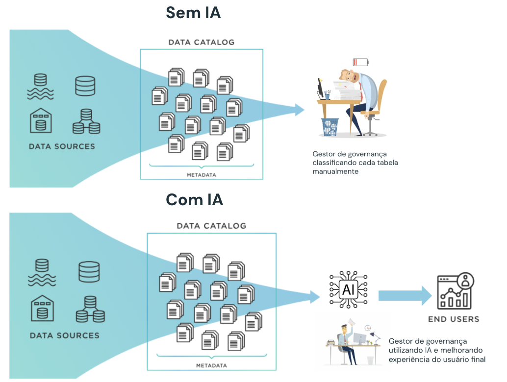

# Potenciando la Gobernanza de Datos con GenAI

## Visión general

Este proyecto demuestra la implementación de funciones de gobernanza de datos utilizando inteligencia artificial en el entorno de Databricks. Incluye una serie de notebooks que automatizan procesos de preparación, clasificación y documentación de datos.

## Motivación 

A medida que los entornos de datos crecen y la generación de datos se descentraliza, el control de qué datos se guardan en el sistema se vuelve cada vez más desafiante. Los responsables de gobernanza deben habilitar el análisis y el consumo de datos mientras controlan la seguridad del entorno. Rápidamente se vuelve inviable realizar clasificaciones manuales de las tablas. 

Con IA y la creación de políticas, es posible gestionar el acceso y realizar clasificación de datos a gran escala.

## ¿Cómo navegar?

- Comienza por el notebook `00_apertura`. 
- Excepto el notebook auxiliar, recomendamos ejecutar célula por célula para comprender qué hace cada comando. El único cuaderno que requiere ingresar texto es `02_definir_prompt`.
- Encontrarás más instrucciones dentro de cada cuaderno. 
